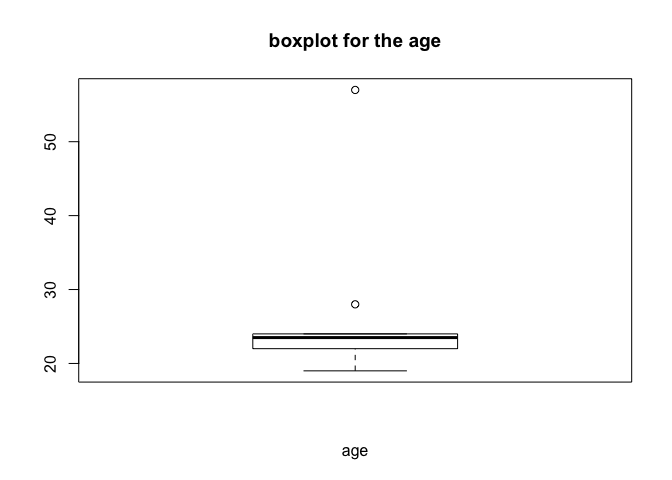
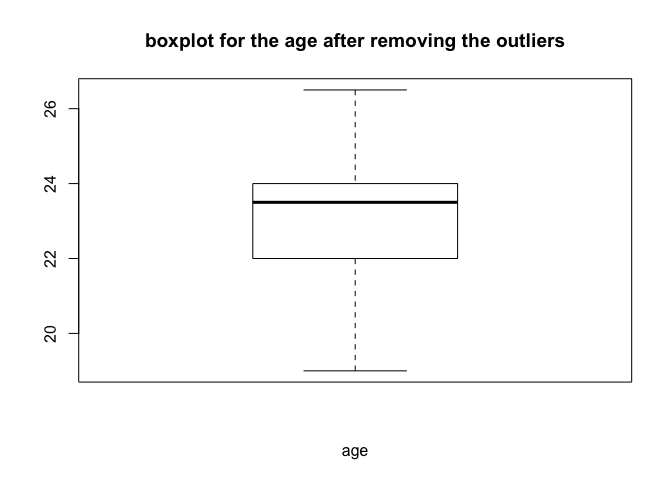
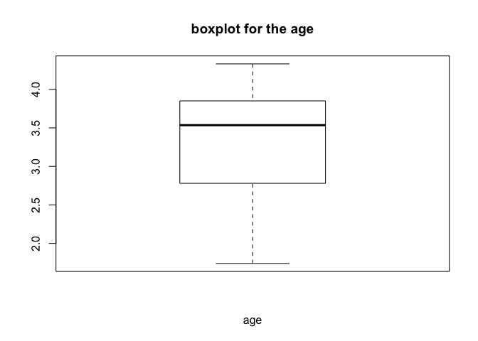

Data Wrangling in R
================
Kaixin Wang
OSCR - Summer Session C 2019

**Note**: Some contents are based on the book *An introduction to data cleaning with R*, by Edwin de Jonge and Mark van der Loo.

1.  Import the input dataset:

``` r
library(readr)
input = read_csv("person_info.csv")
input
```

    ## # A tibble: 10 x 14
    ##    first_name last_name birthday    age state  address  City   phone email
    ##    <chr>      <chr>     <chr>     <int> <chr>  <chr>    <chr>  <chr> <chr>
    ##  1 Carol      Davis     9/29/1996    23 Illin… 1674 Ca… Burr … 312-… curt…
    ##  2 Bruno      Horan     6/11/1995    24 Calif… 1561 St… San D… 858-… guad…
    ##  3 William    Moody     2/27/1997    22 Illin… 541 Jad… Arlin… 979-… roos…
    ##  4 Robin      Steel     8/3/1989     57 Texas  1674 Ca… Josep… 214-… lloy…
    ##  5 Michelle   Roberts   7/17/1995    24 Oregon 1372 Ga… "Port… 503-… ben1…
    ##  6 June       Sneed     3/27/2000    19 Arizo… 2411 Cl… Phoen… 256-… kath…
    ##  7 Curtis     Campbell  3/15/1991    28 Idahol 2760 Sc… Pocat… 979-… just…
    ##  8 Dorothy    Schott    1/2/1997     21 Calif… 2742 Su… Santa… 501-… mega…
    ##  9 Mae        Skinner   3/16/1995    24 Penns… <NA>     Newar… 501-… enri…
    ## 10 David      Victoria  8/2/1996     23 Maine  3327 Ch… Harps… 207-… caro…
    ## # ... with 5 more variables: car_1 <chr>, gpa <dbl>, year <chr>,
    ## #   class_of <int>, online_signiture <chr>

1.  Use boxplot to pinpoint the outliers:

A point is defined as an outlier if it is less than *Q*<sub>1</sub> − 1.5 × *I**Q**R* (interquartile range) or above *Q*<sub>3</sub> + 1.5 × *I**Q**R*.

``` r
# example 1: outliers exist
age = input$age
boxplot(age, xlab = "age", main = "boxplot for the age")
```



``` r
boxplot.stats(age)$out   # value of the outlier(s)
```

    ## [1] 57 28

``` r
outliers = boxplot.stats(age)$out      # value of the outlier(s)
out.index = rep(NA, length(outliers))  # index of the outlier(s)
for (i in 1:length(outliers)){
  out.index[i] = which(age == outliers[i])
}
age[out.index] <- mean(age, na.rm = T) # impute the outliers with the average value
age
```

    ##  [1] 23.0 24.0 22.0 26.5 24.0 19.0 26.5 21.0 24.0 23.0

``` r
# re-plot the boxplot without outliers
boxplot(age, xlab = "age", main = "boxplot for the age after removing the outliers")
```



``` r
# example 2: no outliers exist
grade = input$gpa
boxplot(grade, xlab = "age", main = "boxplot for the age")
```



``` r
boxplot.stats(grade)$out   # value of the outlier(s)
```

    ## numeric(0)

``` r
outliers = boxplot.stats(grade)$out    # value of the outlier(s)
out.index = rep(NA, length(outliers))  # index of the outlier(s)
for (i in 1:length(outliers)){
  out.index[i] = which(grade == outliers[i])
}
grade[out.index] <- mean(grade, na.rm = T) # impute the outliers with the average value
grade
```

    ##  [1] 2.85 3.47 2.78 4.33 3.75 3.60 2.32 3.93 3.85 1.74

``` r
# re-plot the boxplot to check that the data remains the same
boxplot(age, xlab = "age", main = "boxplot for the age after removing the outliers")
```


